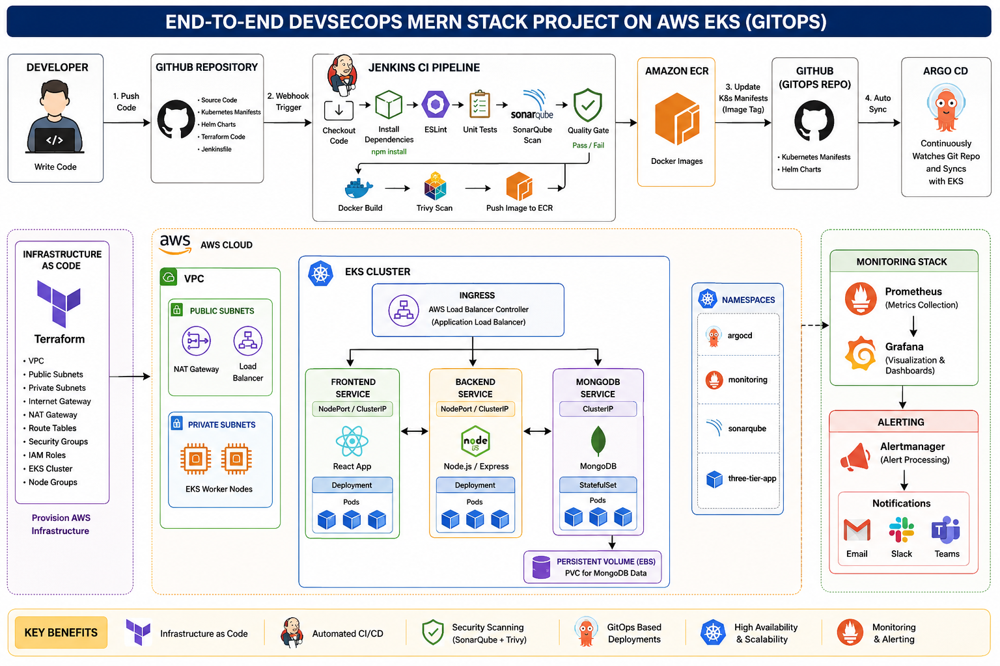
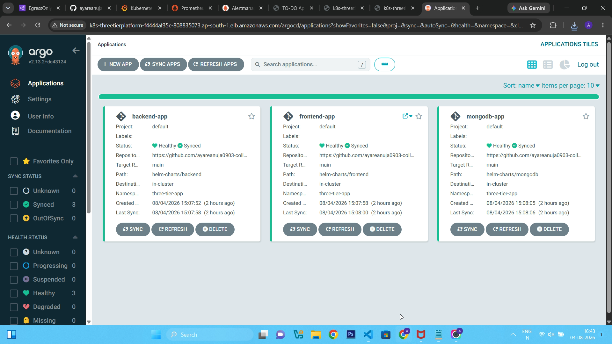
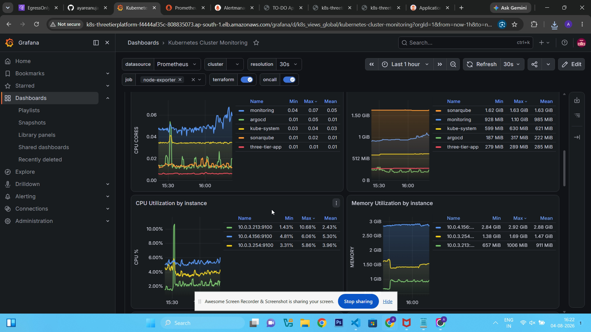
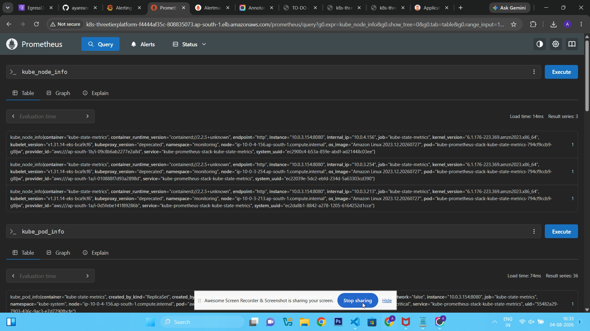
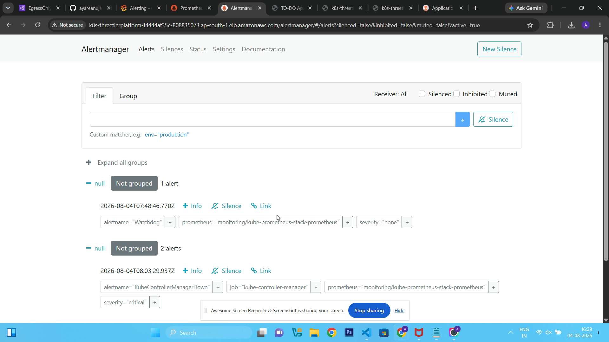
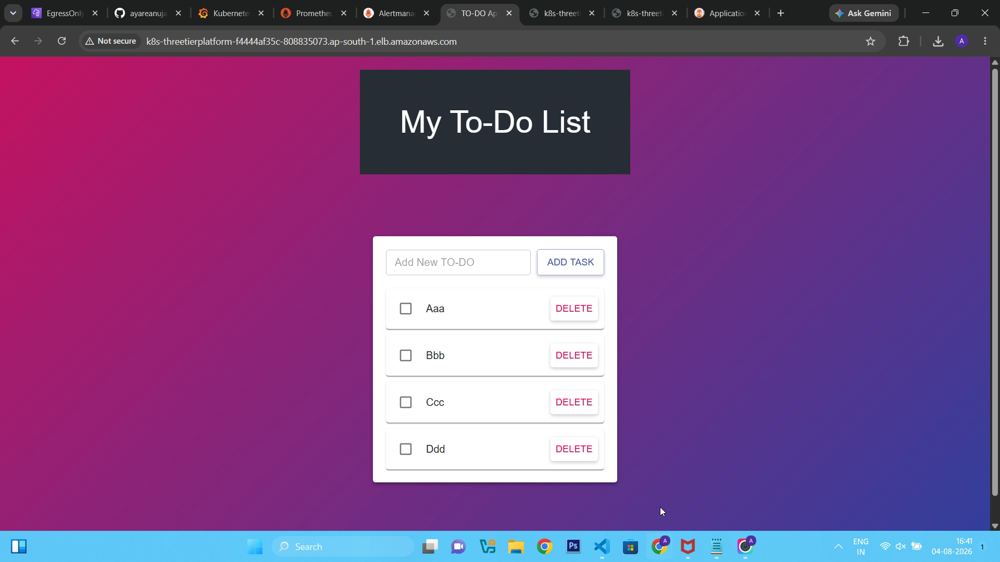

<h1>🚀 End-to-End Kubernetes Three-Tier DevSecOps MERN Stack Project on AWS EKS</h1>

---

## Project Overview

<p align="center">
  
</p>


Designed and implemented a complete **Three-Tier MERN Stack application deployment** on **Amazon Web Services (AWS)** using modern **DevSecOps** practices. The project automates infrastructure provisioning, CI/CD, GitOps deployment, security scanning, and monitoring for a production-ready Kubernetes environment.

The application consists of a **React frontend**, **Node.js/Express backend**, and **MongoDB database**, deployed on **Amazon EKS** with automated delivery using **Jenkins** and **ArgoCD**. Infrastructure is provisioned using **Terraform**, servers are configured using **Ansible**, and continuous security scanning is integrated through **SonarQube**, **OWASP Dependency Check**, and **Trivy**.

---

🚀 Project Workflow

```
                Developer
                   │
                   ▼
              GitHub Repository
                   │
                   ▼
              Jenkins Pipeline
                   │
      ┌────────────┴────────────┐
      │                         │
      ▼                         ▼
 SonarQube Scan          Trivy Scan
      │                         │
      └────────────┬────────────┘
                   ▼
            Docker Image Build
                   │
                   ▼
             Amazon ECR Push
                   │
                   ▼
         Update Kubernetes YAML
                   │
                   ▼
                ArgoCD
             (GitOps Sync)
                   │
                   ▼
            Amazon EKS Cluster
                   │
       ┌───────────┼───────────┐
       │           │           │
       ▼           ▼           ▼
   Frontend     Backend     MongoDB
                   │
                   ▼
      AWS Load Balancer Controller
                   │
                   ▼
         Application Load Balancer
                   │
       ┌───────────┼─────────────┐
       ▼           ▼             ▼
   MERN App     ArgoCD      Monitoring
```

---

# 🛠 Technology Stack
```
| Category      | Technologies        |
| ------------- | ------------------- |
| Cloud         | AWS                 |
| IaC           | Terraform           |
| Containers    | Docker              |
| Orchestration | Kubernetes (EKS)    |
| CI/CD         | Jenkins             |
| GitOps        | ArgoCD              |
| Registry      | Amazon ECR          |
| Monitoring    | Prometheus, Grafana |
| Alerting      | Alertmanager        |
| Security      | SonarQube, Trivy    |
| Configuration | Ansible             |
| Database      | MongoDB             |
| Backend       | Node.js, Express    |
| Frontend      | React               |

```

---
# ⚙ Infrastructure Provisioned

The infrastructure is fully automated using **Terraform** and provisions the following AWS resources:

- ✅ Amazon VPC
- ✅ Public & Private Subnets
- ✅ Internet Gateway
- ✅ NAT Gateway
- ✅ Route Tables
- ✅ Security Groups
- ✅ IAM Roles
- ✅ OIDC Provider (IRSA)
- ✅ Amazon EKS Cluster
- ✅ Managed Node Groups
- ✅ Amazon ECR Repositories
- ✅ Jenkins EC2 Instance
- ✅ AWS Application Load Balancer (ALB)

---

# 🔄 CI/CD Pipeline

```text
                     Git Push
                        │
                        ▼
                Jenkins Pipeline
                        │
                        ▼
                 Checkout Code
                        │
                        ▼
             Install Dependencies
                        │
                        ▼
                  Run Unit Tests
                        │
                        ▼
             SonarQube Analysis
                        │
                        ▼
                 Quality Gate
                        │
                        ▼
               Docker Image Build
                        │
                        ▼
                Trivy Image Scan
                        │
                        ▼
           Push Image to Amazon ECR
                        │
                        ▼
        Update Kubernetes Manifests
                        │
                        ▼
                    Git Push
                        │
                        ▼
                 ArgoCD Auto Sync
                        │
                        ▼
             Deploy to Amazon EKS
```

---

# ☸ Kubernetes Resources

The application is deployed using the following Kubernetes resources:

- Namespace
- Deployment
- ReplicaSet
- Service
- ConfigMap
- Secret
- Ingress
- Persistent Volume (PV)
- Persistent Volume Claim (PVC)
- Horizontal Pod Autoscaler (HPA)

---

# 📊 Monitoring Stack

| Component | Purpose |
|-----------|---------|
| **Prometheus** | Metrics Collection |
| **Grafana** | Visualization & Dashboards |
| **Alertmanager** | Alert Management |
| **Node Exporter** | Node Metrics |
| **kube-state-metrics** | Kubernetes Cluster Metrics |

---

# 🔐 Security

## SonarQube

- ✅ Static Code Analysis
- ✅ Code Quality Gate
- ✅ Bug Detection
- ✅ Vulnerability Detection
- ✅ Code Smell Analysis

### Trivy

- ✅ Container Image Scanning
- ✅ Vulnerability Scanning
- ✅ Misconfiguration Detection
- ✅ Secret Scanning

---

# 📸 Project Screenshots

## Jenkins Dashboard

```
screenshots/jenkins.png
```

---

## SonarQube Dashboard

```
screenshots/sonarqube.png
```

---

## ArgoCD Dashboard
  

---

## Grafana Dashboard

  
---

## Prometheus Dashboard
  
---

## Alertmanager Dashboard

  
---

## MERN Application
  
---

# 🚀 Deployment Guide

## 1️⃣ Clone Repository

```bash
git clone https://github.com/ayareanuja0903-collab/End-to-End-Kubernetes-Three-Tier-DevSecOps-MERN-Stack-Project.git

cd End-to-End-Kubernetes-Three-Tier-DevSecOps-MERN-Stack-Project
```

---

## 2️⃣ Provision AWS Infrastructure

```bash
cd Terraform

terraform init

terraform plan

terraform apply
```

---

## 3️⃣ Configure Jenkins Server

```bash
cd ../Ansible

ansible-playbook site.yml
```

---

## 4️⃣ Deploy Kubernetes Resources

```bash
kubectl apply -f ArgoCD/applications/
```

---

# ✅ Verification

Verify that the infrastructure and application are running correctly.

```bash
kubectl get nodes

kubectl get pods -A

kubectl get svc -A

kubectl get ingress -A
```

---

# Key Features

- End-to-End DevSecOps Pipeline
- Infrastructure as Code using Terraform
- Automated Server Configuration using Ansible
- Continuous Integration with Jenkins
- GitOps Deployment using ArgoCD
- Docker Containerization
- Kubernetes Orchestration on Amazon EKS
- Amazon ECR Image Repository
- Automated Security Scanning
- Horizontal Pod Autoscaling
- High Availability Deployment
- Centralized Monitoring using Prometheus & Grafana

---

# Project Outcome

- Automated the complete software delivery lifecycle from infrastructure provisioning to production deployment.
- Reduced manual deployment effort through Infrastructure as Code and GitOps automation.
- Improved deployment consistency, scalability, and reliability using Kubernetes and Amazon EKS.
- Integrated automated security scanning into the CI/CD pipeline to identify code, dependency, and container vulnerabilities early.
- Enabled real-time monitoring and observability using Prometheus and Grafana dashboards.
- Built a production-ready DevSecOps platform following industry best practices.

---

# Skills Demonstrated

- AWS Cloud
- Terraform
- Ansible
- Docker
- Kubernetes
- Amazon EKS
- Amazon ECR
- Jenkins
- GitHub
- GitHub Webhooks
- ArgoCD
- GitOps
- DevSecOps
- SonarQube
- Trivy
- OWASP Dependency Check
- Prometheus
- Grafana
- React.js
- Node.js
- Express.js
- MongoDB
- Linux
- Shell Scripting
- CI/CD Pipeline Design
- Infrastructure Automation

# 👩‍💻 Author

**Anuja Ayare**

DevOps | Cloud | Kubernetes | Terraform | Jenkins | AWS

---
